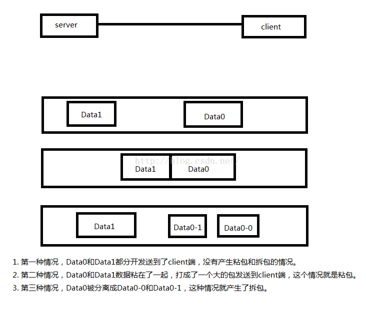

## Socket编程 TCP粘包  

### TCP粘包和拆包、断包  

数据传输时，我们经常会使用tcp协议传输数据。当我们使用tcp长连接传输不同类型的数据时，会产生粘包、拆包的问题。  

粘包的产生：粘包可能在服务端产生也可能在客户断产生，提交数据给tcp发送时，tcp并不立刻发送此段数据,而是等待一
小段时间,看看在等待期间是否还有要发送的数据,若有则会一次把这两段数据发送出去，造成粘包；另一端在接收到数据库
后，放到缓冲区中，如果消息没有被及时从缓存区取走，下次在取数据的时候可能就会出现一次取出多个数据包的情况，造成
粘包现象。  
断包的产生：使用tcp传送数据时，有可能数据过大，使得发送方缓冲区无法一次发送，造成另一端只收到的数据不完整，所以
要等待数据完全接收到再解析数据。  
  
tcp粘包、半包的处理方式：一是采用分隔符的方式，采用特殊的分隔符作为一个数据包的结尾；二是采用给每个包的特定位置
（如包头两个字节）加上数据包的长度信息，另一端收到数据后根据数据包的长度截取特定长度的数据解析，假设包头信息的数
据长度为infoLen，接收到的数据包真实长度为trueLen，那么有如下几种情况：  
>* infoLen>trueLen，半包。  
>* infoLen<trueLen，粘包。  
>* infoLen=trueLen，正常。  