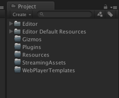
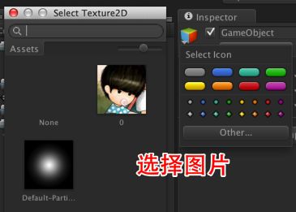

## Unity手游开发中所有特殊的文件夹  

这里列举出手游开发中用到了所有特殊文件夹。  
  
* 1.Editor  
Editor文件夹可以在根目录下，也可以在子目录里，只要名子叫Editor就可以。
比如目录：/xxx/xxx/Editor  和 /Editor 是一样的，无论多少个叫Editor的文
件夹都可以。Editor下面放的所有资源文件或者脚本文件都不会被打进发布包中，
并且脚本也只能在编辑时使用。一般呢会把一些工具类的脚本放在这里，或者是
一些编辑时用的DLL。 比如我们现在要做类似技能编辑器，那么编辑器的代码放
在这里是再好不过了，因为实际运行时我们只需要编辑器生成的文件，而不需要
编辑器的核心代码。  

* 2.Editor Default Resources  
Editor Default Resources注意中间是有空格的，它必须放在Project视图的根目录下，如果你想放在/xxx/xxx/Editor Default Resources 这样是不行的。你可以把编辑器用到的一些资源放在这里，比如图片、文本文件、等等。它和Editor文件夹一样都不会被打到最终发布包里，仅仅用于开发时使用。你可以直接通过EditorGUIUtility.Load去读取该文件夹下的资源。  
  ```C#  
  TextAsset text = EditorGUIUtility.Load("test.txt")as TextAsset;
  Debug.Log(text.text);
  ```  

* 3.Gizmos  
我觉得这个文件夹其实没什么用处，如下代码所示它可以在Scene视图里给某个坐标绘制一个icon。它的好处是可以传一个Vecotor3 作为图片显示的位置。 参数2就是图  片的名子，当然这个图片必须放在Gizmos文件夹下面。  
  ```C#  
  void OnDrawGizmos() {
          Gizmos.DrawIcon(transform.position, "0.png", true);
  }
  ```  
  如果只想挂在某个游戏对象身上，那么在Inspecotr里面就可以直接设置。。  
    
  这里还是要说说OnDrawGizmos()方法，只要脚本继承了MonoBehaviour后，并且在编辑模式下就会每一帧都执行它。发布的游戏肯定就不会执行了，它只能用于在scene视图中绘制一些小物件。比如要做摄像机轨迹，那么肯定是要在Scene视图中做一个预览的线，那么用Gizmos.DrawLine 和Gizmos.DrawFrustum就再好不过了。  

* 4.Plugins  
如果做手机游戏开发一般 andoird 或者 ios 要接一些sdk 可以把sdk依赖的库文件 放在这里，比如 .so .jar .a 文件。这样打完包以后就会自动把这些文件打在你的包中。  

* 5.Resources  
可以在根目录下，也可以在子目录里，只要名子叫Resources就可以。比如目录：/xxx/xxx/Resources  和 /Resources 是一样的，无论多少个叫Resources的文件夹都可以。Resources文件夹下的资源不管你用还是不用都会被打包进.apk或者.ipa  

  Resource.Load ：编辑时和运行时都可以通过Resource.Load来直接读取。  

  Resources.LoadAssetAtPath() ：它可以读取Assets目录下的任意文件夹下的资源，它可以在编辑时或者编辑器运行时用，它但是它不能在真机上用，它的路径是”Assets/xx/xx.xxx” 必须是这种路径，并且要带文件的后缀名。  

  AssetDatabase.LoadAssetAtPath()：它可以读取Assets目录下的任意文件夹下的资源，它只能在编辑时用。它的路径是”Assets/xx/xx.xxx” 必须是这种路径，并且要带文件的后缀名。  

  我觉得在电脑上开发的时候尽量来用Resource.Load() 或者 Resources.LoadAssetAtPath() ，假如手机上选择一部分资源要打assetbundle，一部分资源Resource.Load().那么在做.apk或者.ipa的时候 现在都是用脚本来自动化打包，在打包之前 可以用AssetDatabase.MoveAsset()把已经打包成assetbundle的原始文件从Resources文件夹下移动出去在打包，这样打出来的运行包就不会包行多余的文件了。打完包以后再把移动出去的文件夹移动回来。  

* 6.StreamingAssets  

  这个文件夹下的资源也会全都打包在.apk或者.ipa 它和Resources的区别是，Resources会压缩文件，但是它不会压缩原封不动的打包进去。并且它是一个只读的文件夹，就是程序运行时只能读 不能写。它在各个平台下的路径是不同的，不过你可以用Application.streamingAssetsPath 它会根据当前的平台选择对应的路径。  

  有些游戏为了让所有的资源全部使用assetbundle，会把一些初始的assetbundle放在StreamingAssets目录下，运行程序的时候在把这些assetbundle拷贝在Application.persistentDataPath目录下，如果这些assetbundle有更新的话，那么下载到新的assetbundle在把Application.persistentDataPath目录下原有的覆盖掉。  

  因为Application.persistentDataPath目录是应用程序的沙盒目录，所以打包之前是没有这个目录的，直到应用程序在手机上安装完毕才有这个目录。  

  StreamingAssets目录下的资源都是不压缩的，所以它比较大会占空间，比如你的应用装在手机上会占用100M的容量，那么你又在StreamingAssets放了一个100M的assetbundle，那么此时在装在手机上就会在200M的容量。  
