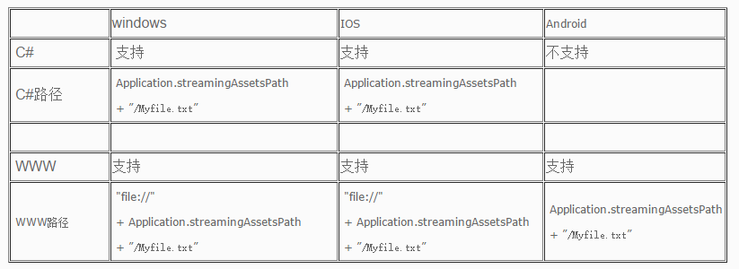

## Unity文件操作路径  
IOS:  
Application.dataPath :               Application/xxxxxxxx-xxxx-xxxx-xxxx-xxxxxxxxxxxx/xxx.app/Data  
Application.streamingAssetsPath :   Application/xxxxxxxx-xxxx-xxxx-xxxx-xxxxxxxxxxxx/xxx.app/Data/Raw  
Application.persistentDataPath :      Application/xxxxxxxx-xxxx-xxxx-xxxx-xxxxxxxxxxxx/Documents  
Application.temporaryCachePath :   Application/xxxxxxxx-xxxx-xxxx-xxxx-xxxxxxxxxxxx/Library/Caches  

Android:  
Application.dataPath :                         /data/app/xxx.xxx.xxx.apk  
Application.streamingAssetsPath :      jar:file:///data/app/xxx.xxx.xxx.apk/!/assets  
Application.persistentDataPath :         /data/data/xxx.xxx.xxx/files  
Application.temporaryCachePath :      /data/data/xxx.xxx.xxx/cache  

Windows:  
Application.dataPath :                         /Assets  
Application.streamingAssetsPath :      /Assets/StreamingAssets  
Application.persistentDataPath :         C:/Users/xxxx/AppData/LocalLow/CompanyName/ProductName  
Application.temporaryCachePath :      C:/Users/xxxx/AppData/Local/Temp/CompanyName/ProductName  

Mac:  
Application.dataPath :                         /Assets  
Application.streamingAssetsPath :      /Assets/StreamingAssets  
Application.persistentDataPath :         /Users/xxxx/Library/Caches/CompanyName/Product Name  
Application.temporaryCachePath :     /var/folders/57/6b4_9w8113x2fsmzx_yhrhvh0000gn/T/CompanyName/Product Name  


Windows Web Player:  
Application.dataPath :             file:///D:/MyGame/WebPlayer (即导包后保存的文件夹，html文件所在文件夹)  
Application.streamingAssetsPath : --  
Application.persistentDataPath : --  
Application.temporaryCachePath : --  

---  
### 1.Resources文件夹  
Resources文件夹是一个只读的文件夹，通过Resources.Load()来读取对象。因为这个文件夹下的所有资源都可以运行时来加载，所以Resources文件夹下的所有东西都会被无条件的打到发布包中。建议这个文件夹下只放Prefab或者一些Object对象，因为Prefab会自动过滤掉对象上不需要的资源。举个例子我把模型文件还有贴图文件都放在了Resources文件夹下，但是我有两张贴图是没有在模型上用的，那么此时这两张没用的贴图也会被打包到发布包中。假如这里我用Prefab，那么Prefab会自动过滤到这两张不被用的贴图，这样发布包就会小一些了。  

### 2.StreamingAssets  
StreamingAssets文件夹也是一个只读的文件夹，但是它和Resources有点区别，Resources文件夹下的资源会进行一次压缩，而且也会加密，不使用点特殊办法是拿不到原始资源的。但是StreamingAssets文件夹就不一样了，它下面的所有资源不会被加密，然后是原封不动的打包到发布包中，这样很容易就拿到里面的文件。所以StreamingAssets适合放一些二进制文件，而Resources更适合放一些GameObject和Object文件。 StreamingAssets 只能用过www类来读取！！  

StreamingAssets，在不同的平台上面 (Windows, Ios ,Android),该目录最终发布的位置不同，所以读取的方法也不同。  
  

WWW是异步加载所以执行加载命令式不能直接执行读取解析操作，要等待  
```C#
WWW www = new WWW(filePath);
yield return www; // while (!www.isDone) {}
result = www.text;
```
Android之所以不支持C# IO流 方式读取StreamingAssets下的文件，是因为Android手机中 StreamingAssets下的文件 都包含在压缩的.jar文件中（这基本上与标准的zip压缩文件的格式相同）。这意味着，如果你不使用Unity中的WWW类去检索文件，那么你需要使用额外的软件去查看.jar的存档并获取该文件。  

安卓上跟其他平台不一样，安装后，这些文件实际上是在一个Jar压缩包里，所以不能直接用读取文件的函数去读，而要用WWW方式。具体做法如下:  
1.把你要读取的文件放在Unity项目的Assets/StreamingAssets文件夹下面，没有这个文件夹的话自己建一个。  
2.读取的代码(假设名为"文件.txt")  
```C#
byte[] InBytes; //用来存储读入的数据 
if (Application.platform == RuntimePlatform.Android)  //判断当前程序是否运行在安卓下 
{ 
        string FileName = "jar:file://" + Application.dataPath + "!/assets/" + "文件.txt"; 
        WWW www = new WWW(FileName);     //WWW会自动开始读取文件 
        while(!www.isDone){}             //WWW是异步读取，所以要用循环来等待 
        InBytes = www.bytes;             //存到字节数组里 

} 
else 
{ 
        //其他平台的读取代码 
}
```
### 补充：
各目录权限：  

根目录：StreamingAssets文件夹  
```C#
#if UNITY_EDITOR
 string filepath = Application.dataPath +"/StreamingAssets"+"/my.xml";
#elif UNITY_IPHONE
 string filepath = Application.dataPath +"/Raw"+"/my.xml";
#elif UNITY_ANDROID
 string filepath = "jar:file://" + Application.dataPath + "!/assets/"+"/my.xml;
#endif
```
根目录：Resources 文件夹  
可以使用Resources.Load("名字"); 把文件夹中的对象加载出来  

根目录：Application.dataPath 文件夹  
可以使用Application.dataPath进行读操作  
Application.dataPath： 只可读不可写，放置一些资源数据  

Application.persistentDataPath  
IOS与android平台都可以使用这个目录下进行读写操作，可以存放各种配置文件进行修改之类的。  
在PC上的地址是：C:\Users\用户名 \AppData\LocalLow\DefaultCompany\test  

### 总结：  
一.在项目根目录中创建Resources文件夹来保存文件。  
可以使用Resources.Load("文件名字，注：不包括文件后缀名");把文件夹中的对象加载出来。  
注：此方可实现对文件实施“增删查改”等操作，但打包后不可以更改了。  

二.直接放在项目根路径下来保存文件  
在直接使用Application.dataPath来读取文件进行操作。   
注：移动端是没有访问权限的。  

三.在项目根目录中创建StreamingAssets文件夹来保存文件。  
1.可使用Application.dataPath来读取文件进行操作：  
```C#
#if UNITY_EDITOR
 string filepath = Application.dataPath +"/StreamingAssets"+"/my.xml";
#elif UNITY_IPHONE
 string filepath = Application.dataPath +"/Raw"+"/my.xml";
#elif UNITY_ANDROID
 string filepath = "jar:file://" + Application.dataPath + "!/assets/"+"/my.xml;
#endif
```
2.直接使用Application.streamingAssetsPath来读取文件进行操作。  
注：此方法在pc/Mac电脑中可实现对文件实施“增删查改”等操作，但在移动端只支持读取操作。  

四.使用Application.persistentDataPath来操作文件（荐）  
该文件存在手机沙盒中，因此不能直接存放文件。  
1.通过服务器直接下载保存到该位置，也可以通过Md5码比对下载更新新的资源  
2.没有服务器的，只有间接通过文件流的方式从本地读取并写入Application.persistentDataPath文件下，然后再通过Application.persistentDataPath来读取操作。  
注：在Pc/Mac电脑 以及Android跟Ipad、ipone都可对文件进行任意操作，另外在IOS上该目录下的东西可以被iCloud自动备份。  


