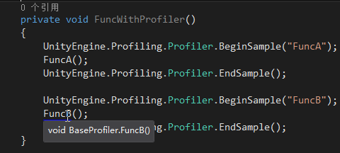

## Profiler分析器使用  

### 说明  
  
```C#  
    private void FuncWithProfiler()
    {
        UnityEngine.Profiling.Profiler.BeginSample("FuncA");
        FuncA();
        UnityEngine.Profiling.Profiler.EndSample();

        UnityEngine.Profiling.Profiler.BeginSample("FuncB");
        FuncB();
        UnityEngine.Profiling.Profiler.EndSample();
    }
```  
如果需要脚本里面的函数也参与Profiler分析的话，需要加上代码：  
```C#  
	UnityEngine.Profiling.Profiler.BeginSample("FuncA");
	FuncA();
	UnityEngine.Profiling.Profiler.EndSample();
```  

		

